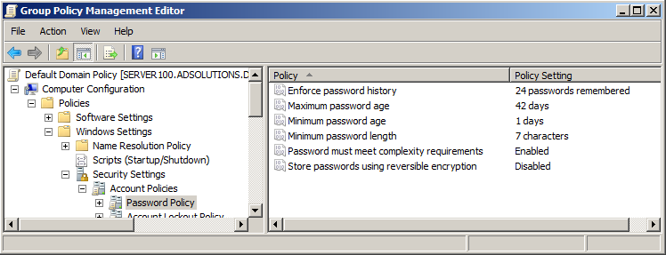
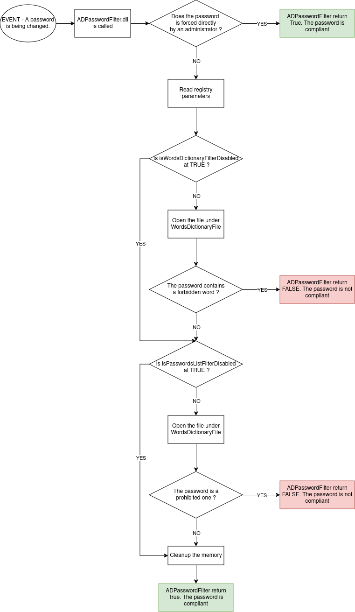
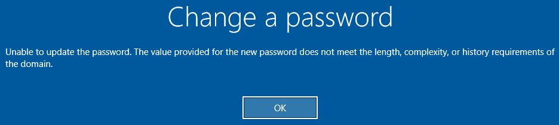

# How it works
---

When a user wishes to change his password, the request is sent to the *Domain Controller* and it's the *Local Security Authority* service that receives and processes it. This service apply filtering in line with the password policy defined in the domain.

By default, password management, through GPOs, does not allow any advanced password filtering.

Microsoft offers to implement its own filtering functions via DLLs.
[Link about topic on this subject](https://learn.microsoft.com/en-us/windows/win32/secmgmt/installing-and-registering-a-password-filter-dll)

The DLL will perform two checks:
- Check that the password doesn't contains any forbidden word (like the company name).
- Check that the password is not prohibited (if it has already been leaked on the Internet).

The next chart resume all steps perform by the DLL:

- **By default, our DLL assumes that the password is compliant.** This state only changes if it does not pass one of the two checks. In case of error during runtime (memory allocation error, can't open the file, can't read the registry), our DLL will return that the password is compliant. This choice is two avoid any blockages for the user.
- **The DLL does not replace other controls performed by the domain controller.** Even if our DLL tell that the password is compliant, others DLLs that performs filtering can say the opposite.
- We can't change the type returned by our function that is called by *LSA* (a boolean). So we can't send back to the user the exact reason why their password isn't compliant. The user will only see this message: 
