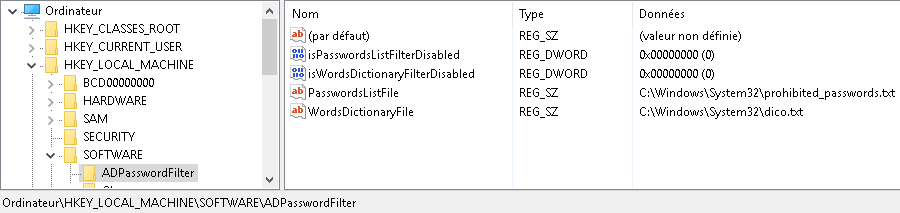
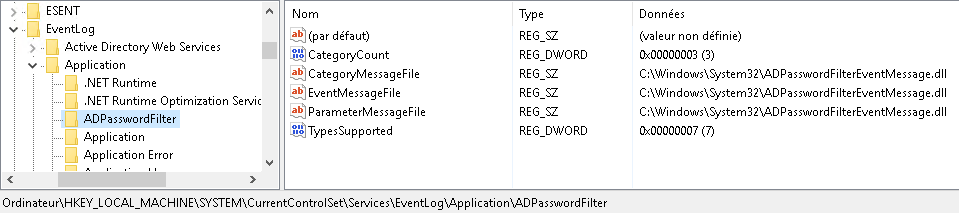
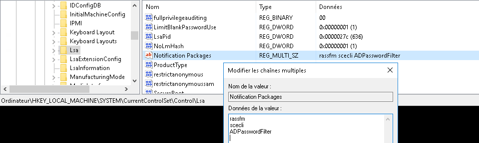
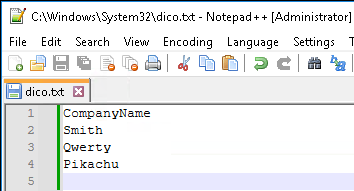
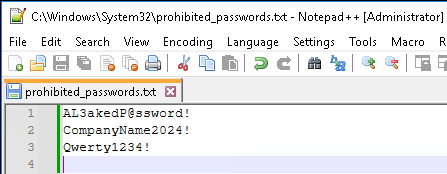
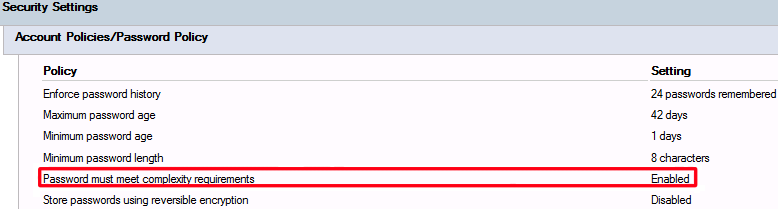

# How to install
---

## Read first

The following steps must be done on each domain controller that can handle a password change.
Ideally, you should automate these steps with a script (powershell) to ensure that the DLL version is identical between servers, and that files containing forbidden words and passwords are also the same.
**A server restart is required to load the DLL in memory through the *Local Security Authority* service.**

### 1 - Copy DLL files

With an admin account, you need to copy *ADPasswordFilter.dll* and *ADPasswordFilterEventMessage.dll* into 'C:\Windows\System32\' directorty.

### 2 - Create registry entries

#### 2.1 - Registry entries for ADPasswordFilter.dll
In the registry, under 'HKEY_LOCAL_MACHINE\SOFTWARE\', create a new key named 'ADPasswordFilter'.
Under this new key, create 4 entries:
- *isPasswordsListFilterDisabled* (type DWORD):
  - Set at '0' (FALSE), the DLL will check if the password is a prohibited one.
  - Set at '1' (TRUE), the DLL will not check if the password is a prohibited one.
- *isWordsDictionaryFilterDisabled* (type DWORD):
  - Set at '0' (FALSE), the DLL will check if the password contains a word that is forbidden.
  - Set at '1' (TRUE), the DLL will not check if the password contains a word that is forbidden.
- *PasswordsListFile* (type STRING): the path of the file containing all prohibited passwords (full path with file extension).
- *WordsDictionaryFile* (type STRING): the path of the file containing the words that are forbidden in a password (full path with file extension).

Example:

#### 2.2 - Registry entries for ADPasswordFilterEventMessage.dll
In the registry, under 'HKEY_LOCAL_MACHINE\SYSTEM\CurrentControlSet\Services\EventLog\Application\', create a new key named 'ADPasswordFilter'.
Under this new key, create 2 entries:
- *CategoryCount* (type DWORD): Set at '3'.
- *TypesSupported* (type DWORD): Set at '7'.

For the next 3 entries, the same value will be apply: 'C:\Windows\System32\ADPasswordFilterEventMessage.dll'
- *CategoryMessageFile* (type STRING).
- *EventMessageFile* (type STRING).
- *ParameterMessageFile* (type STRING).

Example:

#### 2.3 - Modifying LSA service registry

So that the 'LSA' service can take this DLL into account, we need to modify the registry.
In the registry, under 'HKEY_LOCAL_MACHINE\SYSTEM\CurrentControlSet\Control\LSA', modify the key named 'Notification Packages' and add the new string at the end 'ADPasswordFilter' (the name of the DLL without extension).

Example:

### 3 - Create dictionaries files

The DLL need two files:
- A file containing, on each line, a list of words that must not be present in a password.
- A file containing, on each line, the list of passwords that are forbidden.

Example of a file containing words that cannot be included in a password:

Example of a file that contains prohibited passwords:

Each file must be saved as 'UTF-16 LE BOM' encoding.
*It is recommended to use 'Notepad++' for saving file with specific encoding.*

**The path is not imposed, but I advise you to keep everything under 'C:\Windows\System32'.**
**You can freely rename files, as long as the key in the registry is modified accordingly.**

### 4 - Edit Password Policy

Make sure your password policy includes the complexity option :

### 5 - Reboot

In order for the LSA service to take the DLL into account, the server must be restarted.

## Notes and remarks

**For security reasons**:
- I have chosen to give a maximum size to the files that the DLL must browser. So, each file (the one created in 'step 3') must not exceed 1048579 Bytes (1 Mo).
- One line must not contain more than 64 characters (carriage return included).

This can be seen as a very restrictive measure, however:
- It's important for a sensitive program (such as a DLL that manipulates passwords) to impose fixed limits on the I/O it handles.
- A file that is too large can increase processing time when changing passwords.
- If these limitations have already been reached, then it may be time to think again about password management in your company.

You can freely change the values of the register keys used by the DLL 'ADPasswordFilter.dll' without requiring a reboot. The DLL takes changes into account only when a password is being modified. Not at server startup.
The same applies to the contents of dictionary files.
